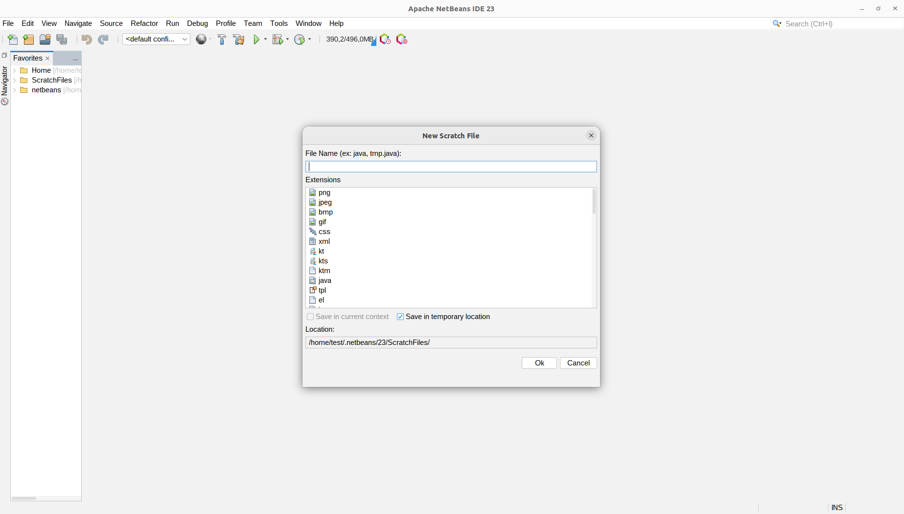

# scratch-files

 

### Requirements

 

## About scratch-files

Netbeans Quick New File Creation

`File -> New Scratch File` or `Ctrl+Alt+N`

### Installation

-   Install from Netbeans \
     `Tools -> Plugins -> Available Plugins -> Install`

    -   If Plugin not available, register the repository
        `Tools -> Plugins -> Settings -> Add`
        https://raw.githubusercontent.com/albilu/scratch-files/master/updates.xml

-   Or Download the latest [release](https://github.com/albilu/scratch-files/releases) and install in Netbeans: \
     `Tools -> Plugins -> Downloaded -> Add Plugins -> Install`

### Sponsor/Contribute/Support

Support this project growth and maintenance by:

-   [Sponsoring it](https://github.com/sponsors/albilu)
-   Submiting [PR](https://github.com/albilu/scratch-files/pulls) for issues in the backlog
-   Starring it 

### Bugs

Please Report any issue at [Issues](https://github.com/albilu/scratch-files/issues).

